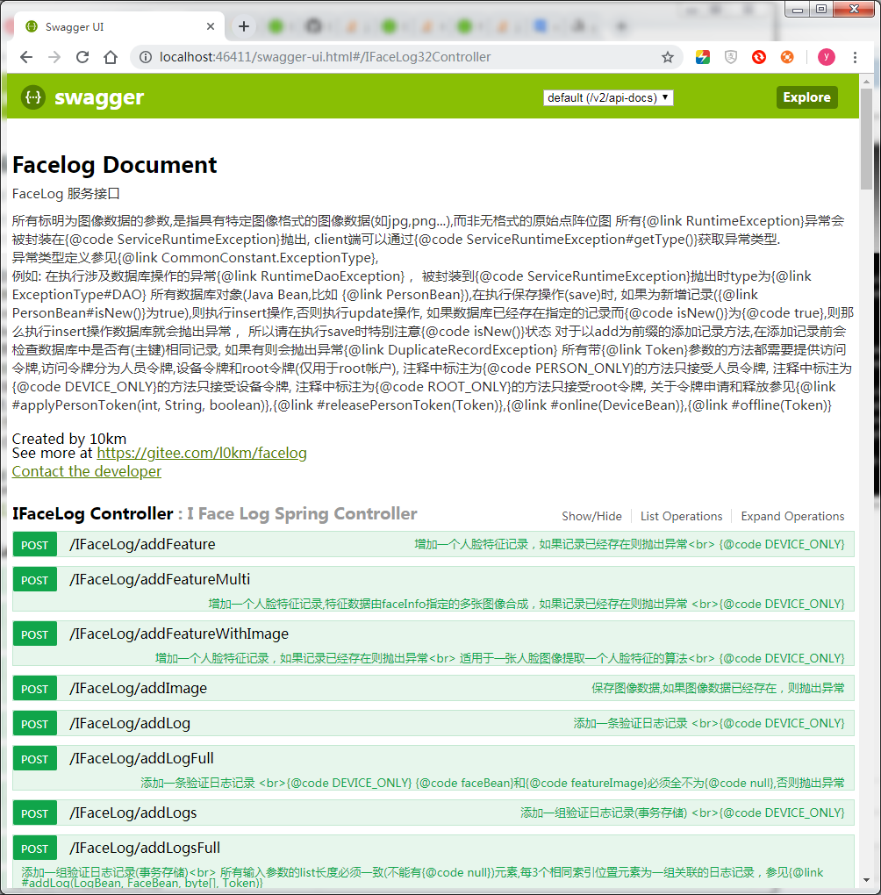

# RESTful API And Swagger Doucument

facelog服务提供RESTful风格的Web API.

facelog基于spring boot将facelog服务封装为RESTful风格的Web API接口，启动了独立的端口号：46411.

启动facelog时默认启动此RESTful服务,以下为启动时的输出，显示在启动了26411(thrift frame),36411(XHR)之后，最后会启动46411端口

如果不需要启动RESTful服务，可以通过修改系统参数`restful.start=false`来禁用，如何修改系统参数，参见 [《facelog 开发手册》](manual/MANUAL.md)的《修改系统参数》一节

	 .d888                            888                   
	d88P"                             888                   
	888                               888                   
	888888  8888b.   .d8888b  .d88b.  888  .d88b.   .d88b.  
	888        "88b d88P"    d8P  Y8b 888 d88""88b d88P"88b 
	888    .d888888 888      88888888 888 888  888 888  888 
	888    888  888 Y88b.    Y8b.     888 Y88..88P Y88b 888 
	888    "Y888888  "Y8888P  "Y8888  888  "Y88P"   "Y88888 
	                                                    888 
	                                               Y8b d88P 
	                                                "Y88P"  
	
	[main][INFO ] (FluentPropertyBeanIntrospector.java:147) Error when creating PropertyDescriptor for public final void org.apache.commons.configuration2.AbstractConfiguration.setProperty(java.lang.String,java.lang.Object)! Ignoring this property.
	 [main][INFO ] (FluentPropertyBeanIntrospector.java:147) Error when creating PropertyDescriptor for public final void org.apache.commons.configuration2.AbstractConfiguration.setProperty(java.lang.String,java.lang.Object)! Ignoring this property.
	 [main][INFO ] (SyslogConfig.java:54) syslog.level(系统日志级别 [OFF,FATAL,ERROR,WARN,INFO,DEBUG,ALL]) = INFO
	 [main][INFO ] (SyslogConfig.java:61) syslog.location(系统日志文件位置) = log/facelog.log
	 [main][INFO ] (JedisPoolLazy.java:271) jedis pool initialized(连接池初始化)  jedis://:hello@localhost:6379/0 timeout : 2000 ms
	 [main][INFO ] (RedisManagement.java:182) start redis server(启动redis服务器)
	 [main][INFO ] (RedisManagement.java:252) start webredis server(启动webredis服务器)
	 webredis start on:16379
	redis localtion:redis://:hello@localhost:6379/0
	[main][INFO ] (GlobalConfig.java:186) redis 服务器参数:
	 [main][INFO ] (GlobalConfig.java:191) host(redis 主机名):localhost
	 [main][INFO ] (GlobalConfig.java:194) port(redis 端口):6379
	 [main][INFO ] (GlobalConfig.java:197) database(redis 数据库):0
	 [main][INFO ] (GlobalConfig.java:201) password(redis 密码):*****
	 [main][INFO ] (GlobalConfig.java:206) timeout(redis 超时[秒]):2000
	 [main][INFO ] (GlobalConfig.java:210) jedisPoolConfig.maxTotal(jedis pool 最大线程数):8
	 [main][INFO ] (GlobalConfig.java:214) redis 安装位置:J:\Redis-x64-2.8.2402
	 [main][INFO ] (GlobalConfig.java:219) 令牌管理参数:
	 [main][INFO ] (GlobalConfig.java:220) 是否执行设备令牌验证:false
	 [main][INFO ] (GlobalConfig.java:223) 是否执行人员令牌验证:false
	 [main][INFO ] (GlobalConfig.java:226) 人员令牌失效时间[分钟]:60
	 [ConfigUtils:171]Load properties from file:/J:/facelog/db/facelog-db-orm/target/classes/conf/database.properties
	[ConfigUtils:95]not defined environment variable 'config_folder'
	[main][INFO ] (ThriftServerService.java:281) RPC Service Parameters(服务运行参数):
	 [main][INFO ] (ThriftServerService.java:282) port: 26411
	 [main][INFO ] (ThriftServerService.java:283) connectionLimit: 32
	 [main][INFO ] (ThriftServerService.java:284) workerThreads: 8
	 [main][INFO ] (ThriftServerService.java:285) idleConnectionTimeout: 60.00s
	 [IFaceLog(T:framed,P:binary) STARTING][INFO ] (NettyServerTransport.java:155) started transport thrift:26411 (:26411)
	 [IFaceLog(T:framed,P:binary) STARTING][INFO ] (ThriftServerService.java:272) IFaceLog(T:framed,P:binary) service is running(服务启动)
	 [main][INFO ] (ThriftServerService.java:281) RPC Service Parameters(服务运行参数):
	 [main][INFO ] (ThriftServerService.java:282) port: 36411
	 [main][INFO ] (ThriftServerService.java:283) connectionLimit: 32
	 [main][INFO ] (ThriftServerService.java:284) workerThreads: 8
	 [main][INFO ] (ThriftServerService.java:285) idleConnectionTimeout: 100.00ms
	 [IFaceLog(T:http,P:json) STARTING][INFO ] (NettyServerTransport.java:155) started transport thrift:36411 (:36411)
	 [IFaceLog(T:http,P:json) STARTING][INFO ] (ThriftServerService.java:272) IFaceLog(T:http,P:json) service is running(服务启动)
	 
	  .   ____          _            __ _ _
	 /\\ / ___'_ __ _ _(_)_ __  __ _ \ \ \ \
	( ( )\___ | '_ | '_| | '_ \/ _` | \ \ \ \
	 \\/  ___)| |_)| | | | | || (_| |  ) ) ) )
	  '  |____| .__|_| |_|_| |_\__, | / / / /
	 =========|_|==============|___/=/_/_/_/
	 :: Spring Boot ::        (v1.5.9.RELEASE)
	
	[main][INFO ] (StartupInfoLogger.java:48) Starting FacelogServiceMain on guyadong-PC with PID 10880 (J:\facelog\facelog-service\target\classes started by guyadong in J:\facelog\facelog-service)
	 [main][INFO ] (SpringApplication.java:593) No active profile set, falling back to default profiles: default
	 [main][INFO ] (AbstractApplicationContext.java:583) Refreshing org.springframework.boot.context.embedded.AnnotationConfigEmbeddedWebApplicationContext@754eb88d: startup date [Fri May 24 14:36:23 CST 2019]; root of context hierarchy
	 [background-preinit][INFO ] (Version.java:30) HV000001: Hibernate Validator 5.3.6.Final
	 [main][INFO ] (AutowiredAnnotationBeanPostProcessor.java:155) JSR-330 'javax.inject.Inject' annotation found and supported for autowiring
	 [main][INFO ] (TomcatEmbeddedServletContainer.java:89) Tomcat initialized with port(s): 8080 (http)
	 五月 24, 2019 2:36:25 下午 org.apache.catalina.core.StandardService startInternal
	信息: Starting service [Tomcat]
	五月 24, 2019 2:36:25 下午 org.apache.catalina.core.StandardEngine startInternal
	信息: Starting Servlet Engine: Apache Tomcat/8.5.23
	五月 24, 2019 2:36:25 下午 org.apache.catalina.core.ApplicationContext log
	信息: Initializing Spring embedded WebApplicationContext
	[localhost-startStop-1][INFO ] (EmbeddedWebApplicationContext.java:276) Root WebApplicationContext: initialization completed in 1968 ms
	 [main][INFO ] (TomcatEmbeddedServletContainer.java:201) Tomcat started on port(s): 46411 (http)
	 [main][INFO ] (StartupInfoLogger.java:57) Started FacelogServiceMain in 12.641 seconds (JVM running for 20.932)
	 PRESS 'quit' OR 'CTRL-C' to exit

## swagger document

facelog提供了swagger在线文档及测试环境，启动RESTful服务后,访问`http://${your.host}:46411/swagger-ui.html`即可打开在线文档。如下图

