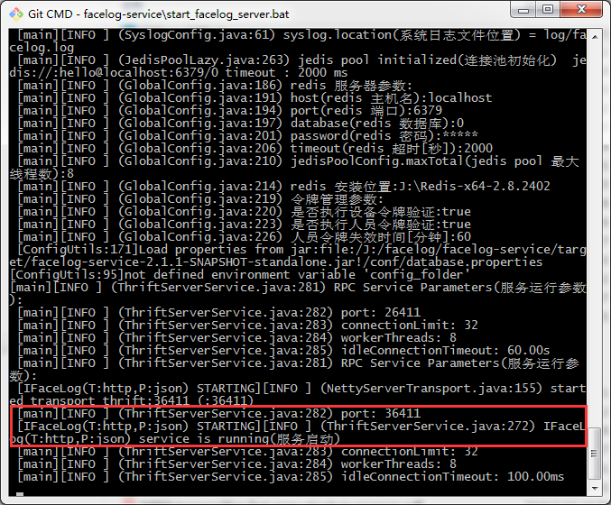

# Access facelog on browser

facelog服务支持在浏览器上访问(javascript)

## javascript

javascript访问facelog服务的示例代码如下：

	
	
	
	
	<!-- jQuery -->
	
	
	
	

	
	

		RESPONSE:
		

	

完整测试代码参见 

[facelog-client-ext/test_js/test.html](facelog-client-ext/test_js/test.html)

## XHR服务启动

自从2.1.0版本开始，facelog支持XHR(XML HTTP Request)服务启动。开启这个服务，才能支持javascript访问。

facelog服务启动时，默认启动XHR服务。

