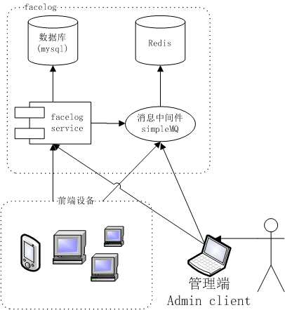
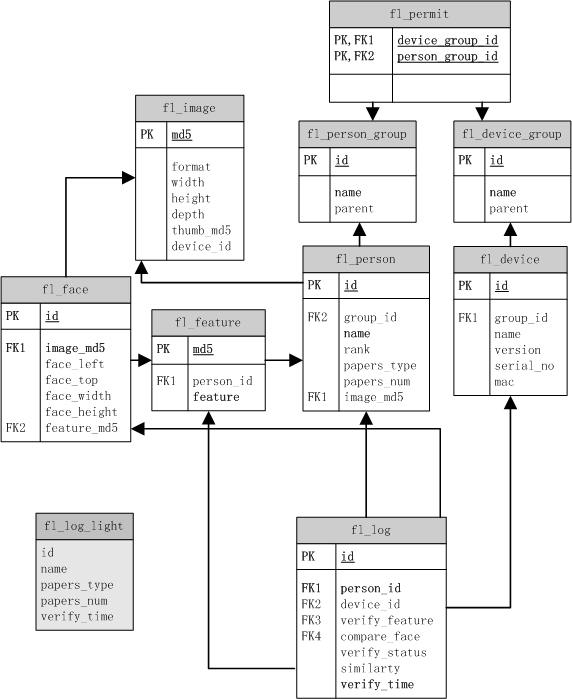

**facelog (人脸验证日志系统)开发手册**

----------

# 概述
## 术语

术语|描述
:-|:-
服务端|提供人脸识别基础管理功能的服务
服务接口|由服务端定义的一组RPC调用方法 
设备端|具备人脸识别功能的计算机控制设备
管理端,admin client|以web应用或本地应用方式管理facelog系统的应用
client端|设备端和管理端的统称
消息系统|基于redis为client端和服务端提供消息服务的中间件
设备命令|管理端发送，设备端接受，执行应用程序定义的动作
命令响应|设备端执行设备命令后返回给命令发送端的执行结果

## 开发背景

随着人脸识别技术的日益成熟，基于人脸识别技术的应用也越来越被市场接受和普及，让我们认识一些典型的应用场景。

### 应用场景1--考勤

考虑开发一个基于网络的人脸识别考勤系统，则需要有数据库系统来存储用户数据，人脸特征数据，这就是一个服务器后端，前端设备负责人脸特征建模、与后端数据库中存储的人脸特征进行比对，根据比对结果，将人员的考勤记录存储于后端数据库，不同的OA系统再通过后端数据库获取人员的考勤数据实现自己的业务逻辑。

### 应用场景2--门禁

再考虑开发一个基于网络的人脸识别门禁系统，前端是分布于企业/组织的具备人脸识别功能门禁设备，后端同样有一个存储所有具有通行权限的人员信息(包含人脸特征数据)。每个人员通过门禁时，门禁设备识别人脸并与数据库中的人脸特征进行比对，确认人员身份时设备放行，并将通行记录存储到后端数据库备案。

当一个人员离职后，人事管理系统将此人员设置为禁止通行后，所有前端设备应该及时收到通知拒绝该人员通行 。这样的门禁系统应用场景可以是一个企业，也可以是一个居住小区，大学宿舍区。

门禁系统还应该具备分组管理能力，比如大门的门禁应该允许所有组织人员通行，但部门/住宅单元的门禁则应该只允许本部门/单元的人通行，门禁设备应该具备分组管理能力，人员也应该具备分组管理。

### 应用场景3--VIP识别

在一些连锁门店销售场景中，人脸识别技术也派上了用场，当一个顾客进入店面时，布置于店门口的摄像头捕捉到人人进行身份识别，如果该顾客在店时进行了消费则在结账付款时，记录顾客的人脸特征，将该顾客纳入VIP识别系统。下次不论顾客再进入全国任何一家连锁店，被VIP识别系统确认身份后，可以通知门店销售人员根据销售策略进行差异化服务。VIP识别系统累积的顾客数据也可以大数据分析提供宝贵的的原始数据源。

### 求同存异

上面几节只是描述了人脸识别技术的几个典型应用场景，这些不同应用场景在技术上都有些共同的需求：

1. 数据管理

	上面的应用场景都是基于 client/service(server) 的网络应用，数据库是必不可少的，前端设备负责人脸识别，后端设备负责数据管理。

2.	数据下发

	当数据库信息变动时，所有前端设备需要及时收到通知。

3.	设备管理
	
	这些应用场景中，前端设备肯定不止一台，而且可能分布在不同的位置，从管理的效率和考虑，对前端设备的统一管理能力都是必不可少的，比如前端设备版本升级，重启，以及一些定制化的需求。

4.	安全认证
	
	这是一般网络应用的基本需求，不论是WEB管理端还是设备端要连接后端应用都需要进行安全认证。权限管理也包含在安全认证范围。

## facelog 是什么

通过上一节的分析，可以发现在开发基于人脸识别网络应用项目的时候，都有一些共同的技术需求，为提高开发效率，避免重复开发，将上面的这些共同需求抽象出来，形成一个开发框架，在此基础上开发的应用系统只需专注于实现具体应用的业务逻辑， 就是本系统设计的初衷。

facelog 是一个用于人脸识别验证的开发框架，其核心是一个基于 thrift 技术的 RPC 服务，为人脸识别应用提供数据管理、安全认证、前端设备管理、数据下发等基本核心的服务。

facelog 只是一个针对人脸识别应用的开发框架，并不针对特定的应用场景，应用项目在 facelog 的基础上根据facelog 提供的服务接口实现具体应用场景下的业务逻辑。

# 系统结构

下图为 facelog 的系统结构示意图

从角色来划分，整个框架分为 facelog 、前端设备、 管理端。

- facelog 为前端设备和管理端通过网络提供服务，facelog 框架实现了face log 服务端的核心功能，以及设备前端和管理端与服务端的底层通讯和接口定义。
- 前諯设备根据业务需求需要应用自己实现业务逻辑，facelog 框架为前端设备提供了实现业务逻辑的统一接口定义。
- 管理端用于系统管理人员对系统的管理操作，根据业务需求在这里可以是一个web应用，也可以设计为一个本地应用。 
## 数据库

### 表结构
facelog 由 mysql 提供数据库服务，下图为表关系结构图，图中只画出每表的主要字段，完整的表结构定义参见[database.sql](../db/sql/create_table.sql)。

**NOTE:**箭头连线为外键关系

1. `fl_device_group`  设备组信息
2. `fl_person_group`  用户组信息
3. `fl_permit`  通行权限关联表
4. `fl_device` 前端设备基本信息
5. `fl_image` 图像信息存储表,用于存储系统中所有用到的图像数据,表中只包含图像基本信息
6. `fl_person` 人员基本描述信息
7. `fl_feature` 用于验证身份的人脸特征数据表
8. `fl_face` 人脸检测信息数据表,用于保存检测到的人脸的所有信息(特征数据除外)
9. `fl_log` 人脸验证日志,记录所有人员验证记录
10. `fl_log_light` 简单日志视图

### 数据缓存

为提高数据库访问效率，facelog 为除 `fl_log，fl_log_light`之外的所有需要频繁读取的表实现缓存能力。

可以从 [`net.gdface.facelog.service.TableManagerInitializer`](../facelog-service/src/main/java/net/gdface/facelog/service/TableManagerInitializer.java)代码为入口查看具体实现。

## 消息系统

service 是被动提供服务，只能由 client 主动向service发起请求。对于实现数据下发，设备管理等需求都需要service或admin client有主动向设备发送通知的能力。对前端设备的主动通知，facelog 基于redis提供了一个简单的消息系统(simpleMQ)。使设备端有能力以频道订阅的方式，异步获取来自服务端和管理端的通知消息。

通过消息系统 faelog 实现以下能力：

### 数据更新

基于消息系统，当后端数据库中的记录有增加，删除或修改时，facelog 服务会自动向指定的redis频道发布消息。设备端只要订阅了该频道，就会收到相应的通知，实现本地数据更新。

facelog 为 `fl_person，fl_feature，fl_permit` 三张表提供了实时更新发布频道。具体定义参见[`net.gdface.facelog.client.CommonConstant`](../facelog-client/src/sql2java/java/net/gdface/facelog/client/CommonConstant.java) 中所有频道(Channel)的定义。前端设备订阅指定的频道，就可以收到相应的通知。

[`net.gdface.facelog.client.SubAdapters`](../facelog-client/src/sql2java/java/net/gdface/facelog/client/SubAdapters.java) 提供了响应对应上述数据库表数据更新消息的基类。应用项目只需要继承对应的类，重载 `onSubscribe`方法实现自己的业务逻辑。

### 设备心跳

对于管理端，实时获取所有前端设备的运行状态，是否在线，是设备管理的基本需要。设备端通过定时通过消息系统发送心跳数据，管理端即可通过接收所有设备的心跳数据实时掌握前端设备的运行状态。

参见 [`net.gdface.facelog.device.Heartbeat`](../facelog-client/src/main/java/net/gdface/facelog/device/Heartbeat.java)
### 设备命令

管理端可以通过消息系统向指定的设备或设备组发送设备命令,前端设备通过设备命令频道收到设备命令，执行相应的业务逻辑，并向命令发送端返回命令执行结果响应。

参见  设备命令管理对象：[`net.gdface.facelog.client.CmdManager`](../facelog-client/src/sql2java/java/net/gdface/facelog/client/CmdManager.java)

参见 设备命令响应对象：[`net.gdface.facelog.client.Ack`](../facelog-client/src/main/java/net/gdface/facelog/client/Ack.java)

## facelog 服务

facelog 服务是一个基于[facebook thrift/swift](https://github.com/facebook/swift "swift") 框架开发的远程调用接口服务。为client端(设备端和管理端)提供数据管理，安全认证等基础服务。

服务接口定义参见
[`net.gdface.facelog.service.BaseFaceLog`](../facelog-service/src/main/java/net/gdface/facelog/service/BaseFaceLog.java) 

服务接口由[`net.gdface.facelog.service.FaceLogImpl`](../facelog-service/src/main/java/net/gdface/facelog/service/FaceLogImpl.java)实现

服务接口在client端的实现参见[`net.gdface.facelog.client.IFaceLogClient`](../facelog-client/src/sql2java/java/net/gdface/facelog/client/IFaceLogClient.java)(同步实现)，
[`net.gdface.facelog.client.IFaceLogClientAsync`](../facelog-client/src/sql2java/java/net/gdface/facelog/client/IFaceLogClientAsync.java)(异步实现)

client端服务实例创建参见工厂类：[`net.gdface.facelog.client.ClientFactory`](../facelog-client/src/sql2java/java/net/gdface/facelog/client/ClientFactory.java)