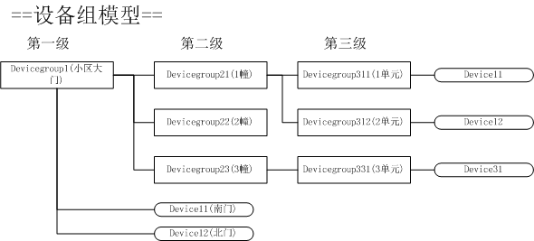
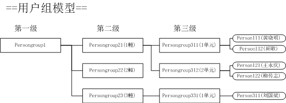
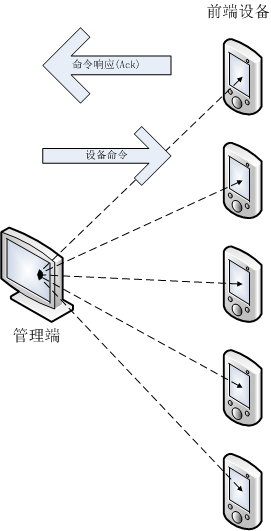

# facelog (人脸验证日志系统)开发手册

## 概述
### 术语

术语|描述
:-|:-
服务端|提供人脸识别基础管理功能的服务
服务接口|由服务端定义的一组RPC调用方法
设备端|具备人脸识别功能的计算机控制设备
管理端,admin client|以web应用或本地应用方式管理facelog系统的应用
client端|设备端和管理端的统称
消息系统|基于redis为client端和服务端提供消息服务的中间件
频道,channel|继承 redis 的频道概念，消息系统传递消息时使用的一个有唯一名字和特定数据类型的数据通道，消息发送者将消息发送到指定的频道，该频道的所有消息订阅者就可以及时收到发送者的消息，对于一个频道，消息发送者和订阅者都可以有多个。
设备命令|管理端发送，设备端接受，执行应用程序定义的动作
命令响应|设备端执行设备命令后返回给命令发送端的执行结果
令牌|访问facelog 服务接口的方法的安全凭证,调用需要令牌的服务接口方法时，必须提供client端申请的令牌才能正常调用。

### 开发背景

随着人脸识别技术的日益成熟，基于人脸识别技术的应用也越来越被市场接受和普及，让我们认识一些典型的应用场景。

#### 应用场景1--考勤

考虑开发一个基于网络的人脸识别考勤系统，则需要有数据库系统来存储用户数据，人脸特征数据，这就是一个服务器后端，前端设备负责人脸特征建模、与后端数据库中存储的人脸特征进行比对，根据比对结果，将人员的考勤记录存储于后端数据库，不同的OA系统再通过后端数据库获取人员的考勤数据实现自己的业务逻辑。

#### 应用场景2--门禁

再考虑开发一个基于网络的人脸识别门禁系统，前端是分布于企业/组织的具备人脸识别功能门禁设备，后端同样有一个存储所有具有通行权限的人员信息(包含人脸特征数据)。每个人员通过门禁时，门禁设备识别人脸并与数据库中的人脸特征进行比对，确认人员身份时设备放行，并将通行记录存储到后端数据库备案。

当一个人员离职后，人事管理系统将此人员设置为禁止通行后，所有前端设备应该及时收到通知拒绝该人员通行 。这样的门禁系统应用场景可以是一个企业，也可以是一个居住小区，大学宿舍区。

门禁系统还应该具备分组管理能力，比如大门的门禁应该允许所有组织人员通行，但部门/住宅单元的门禁则应该只允许本部门/单元的人通行，门禁设备应该具备分组管理能力，人员也应该具备分组管理。

#### 应用场景3--VIP识别

在一些连锁门店销售场景中，人脸识别技术也派上了用场，当一个顾客进入店面时，布置于店门口的摄像头捕捉到人人进行身份识别，如果该顾客在店时进行了消费则在结账付款时，记录顾客的人脸特征，将该顾客纳入VIP识别系统。下次不论顾客再进入全国任何一家连锁店，被VIP识别系统确认身份后，可以通知门店销售人员根据销售策略进行差异化服务。VIP识别系统累积的顾客数据也可以大数据分析提供宝贵的的原始数据源。

#### 求同存异

上面几节只是描述了人脸识别技术的几个典型应用场景，这些不同应用场景在技术上都有些共同的需求：

1. 数据管理

	上面的应用场景都是基于 client/service(server) 的网络应用，数据库是必不可少的，前端设备负责人脸识别，后端设备负责数据管理。

2.	数据下发

	当数据库信息变动时，所有前端设备需要及时收到通知。

3.	设备管理
	
	这些应用场景中，前端设备肯定不止一台，而且可能分布在不同的位置，从管理的效率和考虑，对前端设备的统一管理能力都是必不可少的，比如前端设备版本升级，重启，以及一些定制化的需求。

4.	安全认证
	
	这是一般网络应用的基本需求，不论是WEB管理端还是设备端要连接后端应用都需要进行安全认证。权限管理也包含在安全认证范围。

### facelog 是什么

通过上一节的分析，可以发现在开发基于人脸识别网络应用项目的时候，都有一些共同的技术需求，为提高开发效率，避免重复开发，将上面的这些共同需求抽象出来，形成一个开发框架，在此基础上开发的应用系统只需专注于实现具体应用的业务逻辑， 就是本系统设计的初衷。

facelog 是一个用于人脸识别验证的开发框架，其核心是一个基于 thrift 技术的 RPC 服务，为人脸识别应用提供数据管理、安全认证、前端设备管理、数据下发等基本核心的服务。

facelog 只是一个针对人脸识别应用的开发框架，并不针对特定的应用场景，应用项目在 facelog 的基础上根据facelog 提供的服务接口实现具体应用场景下的业务逻辑。

## 系统结构

下图为 facelog 的系统结构示意图

从角色来划分，整个框架分为 facelog 、前端设备、 管理端。

- facelog 为前端设备和管理端通过网络提供服务, 所有对 mysql 数据库的操作都由 facelog service 代理,应用系统不直接对数据库进行操作,所有对 redis 数据库的读写操作都通过消息系统中间件代理。facelog 框架实现了face log 服务端的核心功能，以及设备前端和管理端与服务端的底层通讯和接口定义。
- 前諯设备根据业务需求需要应用自己实现业务逻辑，facelog 框架为前端设备提供了实现业务逻辑的统一接口定义。
- 管理端用于系统管理人员对系统的管理操作(用户管理，设备管理)，根据业务需求在这里可以是一个web应用，也可以设计为一个本地应用。 

### 数据库

#### 表结构
facelog 由 mysql 提供数据库服务，下图为表关系结构图，图中只画出每表的主要字段，完整的表结构定义参见[create_table.sql](../db/sql/create_table.sql)。

**NOTE:**箭头连线为外键关系

1. `fl_device_group`  设备组信息
2. `fl_person_group`  用户组信息
3. `fl_permit`  通行权限关联表
4. `fl_device` 前端设备基本信息
5. `fl_image` 图像信息存储表,用于存储系统中所有用到的图像数据,表中只包含图像基本信息
6. `fl_person` 人员基本描述信息
7. `fl_feature` 用于验证身份的人脸特征数据表
8. `fl_face` 人脸检测信息数据表,用于保存检测到的人脸的所有信息(特征数据除外)
9. `fl_log` 人脸验证日志,记录所有人员验证记录
10. `fl_log_light` 简单日志视图

#### 数据缓存

为提高数据库访问效率，facelog 为除 `fl_log，fl_log_light`之外的所有需要频繁读取的表实现缓存能力。

可以从 [`net.gdface.facelog.TableManagerInitializer`](../facelog-local/src/main/java/net/gdface/facelog/TableManagerInitializer.java)代码为入口查看具体实现。

### 消息系统

service 是被动提供服务，只能由 client 主动向service发起请求。对于实现数据下发，设备管理等需求都需要service或admin client有主动向设备发送通知的能力。对前端设备的主动通知，facelog 基于 redis 提供了一个简单的消息系统(simpleMQ)。使设备端有能力以频道订阅的方式，异步获取来自服务端和管理端的通知消息。

通过消息系统 faelog 实现以下能力：

#### 数据更新

基于消息系统，当后端数据库中的记录有增加，删除或修改时，facelog 服务会自动向指定的redis频道发布消息。设备端只要订阅了该频道，就会收到相应的通知，实现本地数据更新。

facelog 为 `fl_person，fl_feature，fl_permit` 三张表提供了实时更新发布频道。具体定义参见[`net.gdface.facelog.client.ChannelConstant`](../facelog-client-base/src/sql2java/java/net/gdface/facelog/client/ChannelConstant.java) 中所有频道(Channel)的定义。前端设备订阅指定的频道，就可以收到相应的通知。

[`net.gdface.facelog.client.SubAdapters`](../facelog-client-base/src/sql2java/java/net/gdface/facelog/client/ChannelConstant.java) 提供了响应对应上述数据库表数据更新消息的基类。应用项目只需要继承对应的类，重载 `onSubscribe`方法实现自己的业务逻辑。

#### 设备心跳

对于管理端，实时获取所有前端设备的运行状态，是否在线，是设备管理的基本需要。设备端通过定时通过消息系统发送心跳数据，管理端即可通过接收所有设备的心跳数据实时掌握前端设备的运行状态。

参见 [`net.gdface.facelog.device.Heartbeat`](../facelog-client-base/src/main/java/net/gdface/facelog/device/Heartbeat.java)

#### 设备命令

管理端可以通过消息系统向指定的设备或设备组发送设备命令,前端设备通过设备命令频道收到设备命令，执行相应的业务逻辑，并向命令发送端返回命令执行结果响应。

参见  设备命令管理对象：[`net.gdface.facelog.client.CmdManager`](../facelog-client-base/src/main/java/net/gdface/facelog/client/CmdManager.java)

参见 设备命令响应对象：[`net.gdface.facelog.client.Ack`](../facelog-client-base/src/main/java/net/gdface/facelog/client/Ack.java)

### facelog 服务

facelog 服务是一个基于[facebook thrift/swift](https://github.com/facebook/swift "swift") 框架开发的远程调用接口服务。为client端提供数据管理，安全认证等基础服务。

服务接口定义参见
[`net.gdface.facelog.IFaceLog`](../facelog-base/src/main/java/net/gdface/facelog/IFaceLog.java) 

服务接口由[`net.gdface.facelog.FaceLogImpl`](../facelog-local/src/main/java/net/gdface/facelog/FaceLogImpl.java)实现

服务接口在client端的实现参见

[`net.gdface.facelog.client.IFaceLogClient`](../facelog-client/src/main/java/net/gdface/facelog/client/IFaceLogClient.java)(同步实现)，

[`net.gdface.facelog.client.IFaceLogClientAsync`](../facelog-client/src/main/java/net/gdface/facelog/client/IFaceLogClientAsync.java)(异步实现)

服务接口适用于android平台的client端的实现参见

[`net.gdface.facelog.client.IFaceLogClient`](../facelog-client-android/src/main/java/net/gdface/facelog/client/IFaceLogClient.java)(同步实现)，

[`net.gdface.facelog.client.IFaceLogClientAsync`](../facelog-client-android/src/main/java/net/gdface/facelog/client/IFaceLogClientAsync.java)(异步实现)

>`IFaceLog`中每个接口定义方法的描述与client端 `IFaceLogClient`保持一致。所以本文中引用接口方法时使用`IFaceLog`和`IFaceLogClient`都是等价的

#### 创建 IFaceLog实例示例

	// 创建 faceLog 服务同步实例
	IFaceLogClient facelogClient = ClientFactory.builder()
									.setHostAndPort("127.0.0.1", DEFAULT_PORT) // 指定服务的主机地址和端口号
									.build(IFaceLogThriftClient.class, IFaceLogClient.class); // 创建实例(同步)
	// 创建 faceLog 服务异步实例
	IFaceLogClientAsync facelogClientAsync = ClientFactory.builder()
									.setHostAndPort("127.0.0.1", DEFAULT_PORT) // 指定服务的主机地址和端口号
									.buildAsync(IFaceLogThriftClient.class,IFaceLogClientAsync.class); // 创建实例(异步)

## 开发指南

### 分组模型

facelog 框架中主要管理的就是两类对象：设备和人员。

为了便于管理，设备和人员都以分组的方式进行管理。以一个住宅区的人脸识别门禁系统为例，以下为设备和人员分组的示意图：

从上面的分组模型可以发现，设备和人员分组都是树状结构，每个设备/人员都属于一个设备/人员组。体现在数据库表结构设计上，就是 `fl_person`和`fl_device`都有`group_id`字段指明当前设备/人员所属的组。
而`fl_device_group`和`fl_device_group`都有 `parent` 字段用于指定自己的父节点

设备组和人员组有关键的区别：

人员组有继承能力：一个人员组，自动继承其（递归）所属的所有父节点的权限和能力。
设备组没有继承能力。

何为继承能力？请看下一节[通行权限]。

### 通行权限

参见[表结构]一节中`fl_permit`表的定义，`fl_permit` 是通行权限关联表，用于管理用户在指定设备上的通行能力。

`fl_permit` 表的主键由两个字段组成: `device_group_id`,`person_group_id`,将一个设备组和一个用户组关联起来。指定属于该用户组的用户可以在属于该设备组的设备上通行。

我们将前面`用户组模型`和`设备组模型`中的用户组和设备组一一对应建立一张虚拟的通行权限关联表记录

device_group_id|person_group_id
:-|:-
DeviceGroup1|PersonGroup1
DeviceGroup21|PersonGroup21
DeviceGroup22|PersonGroup22
DeviceGroup23|PersonGroup23
DeviceGroup311|PersonGroup311
DeviceGroup312|PersonGroup312
DeviceGroup313|PersonGroup313

按照上面通行权限关联表的说明，我们容易理解：
>属于`PersonGroup1`都可以在`DeviceGroup1(小区大门)`下属的设备上通行。

也容易理解：
>`Persongroup311(1单元)`的用户可以在 `DeviceGroup311(1幢1单元)`设备组下属的设备通行。

所以
>属于`Persongroup311(1单元)`的`Person111黄晓明`可以通行`DeviceGroup311(1幢1单元)`设备组下属的门禁设备。

那么`Person111黄晓明`可以通行小区大门么？通行权限关联表中并没有`Persongroup311(1单元)`和 `DeviceGroup1`的关联记录呀。

>当然可以，虽然上面的通行权限关联表是并没有`Persongroup311(1单元)`和 `DeviceGroup1`的记录。但是因为人员组有继承能力，所以`Persongroup311(1单元)`递归继承了所属的父节点`Persongroup21(1幢)`和`Persongroup1`的通行权限。所以`Person111黄晓明`也可以通行大门。

### 安全管理

facelog 的安全机制分为两个层面：

管理端用户验证
:	管理端用户登录系统的用户验证，目前采用传统的密码验证方式

client端 访问数据库的令牌验证
:	client端对 facelog 数据库访问时需要提供合法的令牌

令牌验证的使用范围：

- 对于数据库读取数据操作不需要提供令牌验证
- 对于数据库写操作及涉及安全管理的操作需要提供令牌验证

#### 用户等级

facelog中的用户分为四个等级

type|rank|说明
:-|:-|:-
普通用户|0|无管理权限
操作员|2|可以管理低一级用户，及应用项目定义的权限
管理员|3|可以管理低一级用户，管理设备组用户组，管理通行权限，及应用项目定义的权限
root|4|系统内置帐户，拥有所有管理权限，还可以修改系统配置参数

- 用户级别定义

	`root`为 facelog 内置用户名，无需指定，其他的级别的用户都是由`fl_person`表的`rank`字段来指定。参见表结构定义[create_table.sql](../db/sql/create_table.sql)。

- 用户密码

	`root`用户的密码存储在系统配置文件中(properties)，其他的级别的用户的密码存储在`fl_person`表的`password`字段。

参见[`net.gdface.facelog.CommonConstant.PersonRank`](../facelog-base/src/main/java/net/gdface/facelog/CommonConstant.java)

#### 密码验证

参见facelog 服务接口方法：

    net.gdface.facelog.client.IFaceLogClient.isValidPassword

#### 令牌

令牌是系统安全设计的关键环节，凡是涉及数据写操作或安全管理的facelog服务接口都需要令牌。

令牌本身是由facelog服务生成的一个具有一定时效的数据对象。client端在使用facelog服务之前需要向facelog申请令牌，client端程序结束时应该释放令牌。

一个令牌对象只应由一个cleint使用，可多线程共享，但不可共享给其他client端。

参见服务接口：[`net.gdface.facelog.IFaceLog`](../facelog-base/src/main/java/net/gdface/facelog/IFaceLog.java)，代码注释中对每一个方法是否需要令牌，需要什么类型的令牌都有明确说明。

#### 令牌类型

type|说明
:-|:-
设备令牌|设备端使用的令牌
人员令牌|管理端(管理员，操作员)使用的令牌
root令牌|管理端(root)使用的令牌

参见 [`net.gdface.facelog.Token`](../facelog-base/src/main/java/net/gdface/facelog/Token.java)

#### 令牌有效期

设备令牌目前未定义有效期，所以设备令牌在facelog 服务运行期内一直有效。

人员令牌和root令牌定义了有效期，默认有效期是60分钟。可以通过修改系统参数改变该值，参见`CommonConstant.TOKEN_PERSON_EXPIRE` 。如果令牌过期，要重新申请令牌。

#### 失效令牌自动刷新

根据前面对令牌的说明，我们知道令牌是有有效期的，对于client端(管理端，设备端)而言当使用失效令牌访问服务时会抛出安全异常(`ServiceSecurityException`,其中type字段为安全异常的错误类型)，这时要重新申请令牌。

这个机制对安全来说致关重要，但同时也给client端开发带来困扰，那就是client端调用每个需要令牌的接口方法时都要捕获`ServiceSecurityException`异常，来判断是否为令牌失效异常，这可能会导致代码逻辑非常臃肿。

为解决这个问题，facelog client端提供了失效令牌自动刷新机制，其基本原理是设计一个服务接口代理类(参见 [net.gdface.facelog.client.RefreshTokenDecorator](../facelog-client-base/src/main/java/net/gdface/facelog/client/RefreshTokenDecorator.java))，该代理接口类的实例代理所有服务接口方法，并捕获[`ServiceSecurityException`](../facelog-base/src/main/java/net/gdface/facelog/ServiceSecurityException.java)异常,当判断为异常是由令牌失效导致的,则自动调用令牌申请方法，申请新令牌，然后重新调用前面因为抛出安全异常而失败的方法。

	// 安全异常分类
	public static enum SecurityExceptionType{
        /** 其他未分类异常 */UNCLASSIFIED,
        /** 无效MAC地址 */INVALID_MAC,
        /** 无效序列号 */INVALID_SN,
        /** 序列号被占用 */OCCUPIED_SN,
        /** 无效的设备令牌 */INVALID_TOKEN,
        /** 无效设备ID */INVALID_DEVICE_ID,
        /** 无效人员ID */INVALID_PERSON_ID,
        /** 无效root密码 */INVALID_PASSWORD,
        /** 拒绝令牌申请 */REJECT_APPLY
	}

facelog已经实现了失效令牌自动刷新机制，但应用层要启用这个机制，还需要向`RefreshTokenDecorator`提供申请令牌时必要的参数，比如对于人员令牌和root令牌，需要提供用户的密码，对于设备令牌需要提供设备信息对象([DeviceBean](../facelog-db-base/src/main/java/net/gdface/facelog/db/DeviceBean.java))

如何向令牌自动刷新机制提供这些必要信息呢？这就涉及到另一个类[TokenHelper](../facelog-client-base/src/main/java/net/gdface/facelog/client/TokenHelper.java),TokenHelper类设计用于应用层向client端提供令牌刷新的必要参数，应用层可以继承此类根据需要重写对应的方法提供参数，以让自动刷新机制能正确运行

下面代码展示如何在client端初始化时开启失效令牌自动刷新机制

		IFaceLogClient facelogClient = ClientFactory.builder()
				.setHostAndPort("127.0.0.1", DEFAULT_PORT)
				.setDecorator(RefreshTokenDecorator.makeDecoratorFunction(new TokenHelperTestImpl()))
				.build(IFaceLogThriftClient.class, IFaceLogClient.class);
		// TokenHelperTestImpl为TokenHelper的子类，用于向RefreshTokenDecorator提供申请令牌的相关参数
		// setDecorator方法则将实现令牌自动刷新机制机制的代理接口类实例(Proxy instance)加载到服务接口实例上

关于启动失效令牌自动刷新机制的完整示例参见 [ClientTest](../facelog-client/src/test/java/net/gdface/facelog/client/ClientTest.java)

#### 令牌申请注销

令牌是有时效性的数字凭证，所以client在调用需要令牌难的facelog 服务接口方法前需要申请令牌，然后再用申请到的令牌做为方法参数调用接口方法，当应用程序结束时应该释放令牌，如果不释放令牌，过期令牌也会自动失效并自动从 facelog 令牌数据表中删除。

申请和释放信息都是通过 facelog 服务的接口方法来完成，管理端和设备端申请和释放令牌使用不同的服务接口方法。

client类型|令牌类型|操作|facelog 服务接口方法
:-|:-|:-|:-
设备端|设备令牌|申请|`net.gdface.facelog.client.IFaceLogClient.online(DeviceBean)`
设备端|设备令牌|释放|`net.gdface.facelog.client.IFaceLogClient.offline(Token)`
管理端|人员令牌|申请|`net.gdface.facelog.client.IFaceLogClient.applyPersonToken(int,String,boolean)`
管理端|人员令牌|释放|`net.gdface.facelog.client.IFaceLogClient.releasePersonToken(Token)`
管理端|root令牌|申请|`net.gdface.facelog.client.IFaceLogClient.applyRootToken(String,boolean)`
管理端|root令牌|释放|`net.gdface.facelog.client.IFaceLogClient.releaseRootToken(Token)`

#### 设备注册/注销

`设备注册`就是设备端将自己的设备信息向 facelog 服务登记的过程，只有在facelog 数据库设备表(`fl_device`)有记录的设备，才是facelog 认可的合法设备，才会允许其申请设备令牌。这个动作在设备安装时执行一次就可以了。

`设备注销`与`设备注册`作用相反，就是当前设备将自己的设备信息从facelog 数据库中删除的过程，这个动作需要在设备从facelog 系统中删除时执行一次。

#### 设备注册及令牌申请示例

上一节中介绍了设备令牌的申请方式，要说明的是在设备端申请令牌之前，先要有一个设备注册过程。否则申请令牌不会成功。下面的示例说明设备注册/注销及设备令牌申请/释放的顺序过程。

    @Test
	public void test4RegisterDevice(){
		// 获取当前设备的MAC地址(假设只有一块网卡)
		byte[] address = NetworkUtil.getPhysicalNICs().iterator().next().getHardwareAddress();
		try {
			// 根据MAC地址和设备序列号构造一个DeviceBean数据对象
			DeviceBean device = DeviceBean.builder()
					.mac(NetworkUtil.formatMac(address, null)) // 设备当前设备MAC地址
					.serialNo("12322333") // 设置设备序列号
					.build();
			logger.info(device.toString(true,false));
			// 设备注册
			device = facelogClient.registerDevice(device);
			// 申请设备令牌
			Token deviceToken = facelogClient.online(device);
			// .....

			// 应用结束时通知facelog servcie设备下线，释放设备令牌
			facelogClient.offline(deviceToken);

			// 设备注销，设备从 facelog系统删除时调用
			facelogClient.unregisterDevice(device.getId(), deviceToken);
		} catch(ServiceRuntimeException e){
			e.printServiceStackTrace();
			assertTrue(e.getMessage(),false);
		}catch (ServiceSecurityException e) {
			logger.error(e.getMessage());
			assertTrue(e.getServiceStackTraceMessage(),false);
		}
	}

### 消息系统(simpleMQ)

消息系统([`simpleMQ`][1])是基于[`redis`][2]实现的用于计算机之间通讯的一个中间件jar包。facelog 服务、设备端、管理端使用消息系统的频道(channel)订阅发布功能，进行1对N的通讯.

#### 消息频道

facelog 中的频道类型：

频道类型|说明|定义方式
:-|:-|:-
数据库实时更新频道|用于发布订阅数据库实时更新通知的频道，参见[`数据更新`]章节|公开定义的常量,参见 [`net.gdface.facelog.service.CommonConstant`](../facelog-service/src/sql2java/java/net/gdface/facelog/service/CommonConstant.java)
设备命令频道|用于client设备命令发送和接收的频道|facelog 服务初始化后才确定的常量,非公开，需要通过令牌方法才能获取,**NOTE1**
人员验证实时监控通道名|用于管理端实时获取设备端人员验证通行消息的频道|facelog 服务初始化后才确定的常量,非公开，需要通过令牌方法才能获取，**NOTE1**
设备心跳实时监控通道名|用于管理端实时获取设备端心跳的频道|facelog 服务初始化后才确定的常量,非公开，需要通过令牌方法才能获取，**NOTE1**
设备命令响应频道|用于client端接收设备命令响应的频道|动态申请，如果管理端发送设备命令时需要获取设备端的命令响应，就需要在每次发送设备命令之前向facelog 申请一个设备命令响应频道名参见`设备命令`章节,申请命令响应频道名的方法参见 `net.gdface.facelog.client.IFaceLogClient.applyAckChannel(Token)`

**NOTE1**
>参见 `net.gdface.facelog.client.IFaceLogClient.getRedisParameters(Token)`，`net.gdface.facelog.service.RedisManagement.MQParam`

#### 连接消息系统(redis)

消息系统是基于redis平台的中间件，不论是发送还是接收消息，都需要连接redis.以下为连接redis的示例，在应用程序初始化时执行一次。

    /** redis 连接参数 */
	private static final Map<PropName, Object> redisParam = 
			ImmutableMap.<PropName, Object>of(
					/** redis 主机名 */PropName.host,Protocol.DEFAULT_HOST,
					/** redis 端口号 */PropName.port,Protocol.DEFAULT_PORT,
					/** redis 连接密码 */PropName.password, "password"
					);
	///.....
	/** 根据连接参数创建默认实例 */
	JedisPoolLazy.createDefaultInstance( redisParam);
	// 默认实例创建后，后续可以调用 JedisPoolLazy.getDefaultInstance() 获取并使用这个默认实例

#### 发布消息

利用消息系统发布消息很简单，只要获取一个`IPublisher`实例，就可以向指定的频道发布消息。

消息系统向频道发布消息的接口类为`IPublisher`,参见 [`gu.simplemq.IPublisher`](https://gitee.com/l0km/simplemq/blob/master/src/main/java/gu/simplemq/IPublisher.java)

获取一个`IPublisher`实例的方式参见[`gu.simplemq.redis.RedisFactory#getPublisher`](https://gitee.com/l0km/simplemq/blob/master/src/main/java/gu/simplemq/redis/RedisFactory.java)系列方法

另外参见 [`gu.simplemq.BasePublishTask`](https://gitee.com/l0km/simplemq/blob/master/src/main/java/gu/simplemq/BasePublishTask.java)用于消息发布的线程池执行任务封装

##### 发布消息示例

使用`gu.simplemq.IPublisher`的示例代码

    @Test
	public void test() throws InterruptedException {
		 Channel<Date> chat1 = new Channel<Date>("chat1",Date.class);
		// 获取IPublisher接口实例(edisPublisher)
		IPublisher publisher = RedisFactory.getPublisher(JedisPoolLazy.getDefaultInstance());
		for(int i=0;i<100;++i){
			Date date = new Date();
			// 向频道'chat1'发布消息
			publisher.publish(chat1, date);
			logger.info(date.getTime() +" : " +date.toString());
			Thread.sleep(2000);
		}
	}

#### 订阅消息

消息系统管理消息订阅的实例类为`RedisSubscriber`,参见 [`gu.simplemq.redis.RedisSubscriber`](https://gitee.com/l0km/simplemq/blob/master/src/main/java/gu/simplemq/redis/RedisSubscriber.java)

获取一个`RedisSubscriber`实例的方式参见[`gu.simplemq.redis.RedisFactory#getSubscriber`](https://gitee.com/l0km/simplemq/blob/master/src/main/java/gu/simplemq/redis/RedisFactory.java)系列方法

订阅消息实际就是一个向redis服务器订阅频道并处理消息的的过程。`RedisSubscriber`的`register`方法用于将指定的消息处理代码注册到指定的频道。

#### 消息处理

消息处理的核心接口为`gu.simplemq.IMessageAdapter`，参见[`gu.simplemq.Channel`](https://gitee.com/l0km/simplemq/blob/master/src/main/java/gu/simplemq/Channel.java)中对`IMessageAdapter`的调用

#### 消息订阅处理示例

使用`gu.simplemq.redis.RedisSubscriber`订阅频道消息示例

	@Test
	public void testRedisSubscriber(){
		RedisSubscriber consumer = RedisFactory.getSubscriber(JedisPoolLazy.getDefaultInstance());
		// 频道名 'list1'
		Channel<String> list1 = new Channel<String>("list1",String.class,new IMessageAdapter<String>(){

			@Override
			public void onSubscribe(String t) throws SmqUnsubscribeException {
				logger.info("{}:{}","list1",t);
			}} );
		// 订阅消息，用IMessageAdapter实例显示消息
		consumer.register(list1);
		// 取消订阅
		consumer.unregister(list1);
	}

使用`gu.simplemq.redis.RedisConsumer`订阅队列消息示例(队列消息目前没有在facelog 中用到)

    @Test
	public void testRedisConsumer(){
		// 获取 RedisConsumer 实例
		RedisConsumer consumer = RedisFactory.getConsumer(JedisPoolLazy.getDefaultInstance());
		// 定义 list1, list2,list3 三个队列，并提供相应的消息处理实例IMessageAdapter
		Channel<String> list1 = new Channel<String>("list1",String.class,new IMessageAdapter<String>(){
			@Override
			public void onSubscribe(String t) throws SmqUnsubscribeException {
				logger.info("{}:{}","list1",t);
			}} );
		Channel<String> list2 = new Channel<String>("list2",String.class,new IMessageAdapter<String>(){
			@Override
			public void onSubscribe(String t) throws SmqUnsubscribeException {
				logger.info("{}:{}","list2",t);
			}} );
		Channel<String> list3 = new Channel<String>("list3",String.class,new IMessageAdapter<String>(){
			@Override
			public void onSubscribe(String t) throws SmqUnsubscribeException {
				logger.info("{}:{}","list3",t);
			}} );
		// 订阅消息，用IMessageAdapter实例显示消息
		consumer.register(list1,list2);
		consumer.register(list3);
		// 取消订阅
		consumer.unregister(list1);
	}

### 数据下发

所谓数据下发，实际就是一个数据库表更新消息发布、订阅、处理的过程，当client端订阅了指定频道的消息，就会收到数据库更新的消息通知。

比如，新入职了一名员工，`fl_person`表中会增加一条该员工的记录，facelog 服务向名为`PersonInsert`的频道(在[`net.gdface.facelog.client.CommonConstant`](../facelog-client/src/sql2java/java/net/gdface/facelog/client/CommonConstant.java)中定义)会发布一条消息，该消息的内容很简单，就是该条记录的id(primary key),订阅了该频道的所有client端都会立即收到该消息。client根据收到的id,再通过facelog service向数据库获取该条记录的完整数据。就实现了自动数据下发功能。

client收到消息后如何处理，这属于具体应用的业务逻辑，应该由应用项目根据实际需求来实现。

#### 数据更新消息处理示例

[`net.gdface.facelog.client.SubAdapters`](../facelog-client/src/sql2java/java/net/gdface/facelog/client/SubAdapters.java)提供了一组基类，继承对应的基类可以更简单的实现数据更新通知消息处理。

下面以`fl_person`表的`insert`新增记录消息处理为例说明这组基类的使用方法：

	
	public class PersonInsertAdapterTest implements CommonConstant {	
		@Test
		public void test() {		
			final IFaceLogClient serviceClient = ClientFactory.builder().setHostAndPort("127.0.0.1", DEFAULT_PORT).build();
			// 重载 onSubscribe 方法
			new SubAdapters.BasePersonInsertSubAdapter(){
				@Override
				public void onSubscribe(Integer id) throws SmqUnsubscribeException {
					logger.info("insert person ID:{}",id);
					logger.info("new recored {}",serviceClient.getPerson(id).toString(true, false));
				}			
			}.register(RedisFactory.getSubscriber());// 频道订阅
		}
	}

### 设备心跳监控

管理端可以通过设备心跳监控频道实时获取所有设备的心跳包，示例如下:

	/**
	 * 心跳包测试
	 * @author guyadong
	 *
	 */
	@FixMethodOrder(MethodSorters.NAME_ASCENDING)
	public class HeartbeatTest implements ChannelConstant{
		private static IFaceLogClient facelogClient;
		private static Token rootToken;
		/** redis 连接参数 */
		private static Map<PropName, Object> redisParam = 
				ImmutableMap.<PropName, Object>of(
						/** redis 主机名 */PropName.host,Protocol.DEFAULT_HOST,
						/** redis 端口号 */PropName.port,Protocol.DEFAULT_PORT,
						/** redis 连接密码 */PropName.password, "hello"
						);
		/** 设备心跳监控频道 */
		private static String monitorChannelName;
		@BeforeClass
		public static void setUpBeforeClass() throws Exception {
			// 根据连接参数创建默认实例
			JedisPoolLazy.createDefaultInstance( redisParam);
			// 创建服务实例
			facelogClient = ClientFactory.builder().setHostAndPort("127.0.0.1", DEFAULT_PORT).build();
			// 申请令牌
			rootToken = facelogClient.applyRootToken("guyadong", false);
			// 从facelog service 获取心跳监控频道名
			monitorChannelName = facelogClient.getRedisParameters(rootToken).get(MQParam.HB_MONITOR_CHANNEL);
			logger.info("monitorChannelName = {}",monitorChannelName);
		}
		@AfterClass
		public static void tearDownAfterClass() throws Exception {
			facelogClient.releaseRootToken(rootToken);
		}
		/**
		 * 发送心跳包测试
		 */
		@Test
		public void test1SendHB() {
			byte[] address = new byte[]{0x20,0x20,0x20,0x20,0x20,0x20};
			Heartbeat hb = Heartbeat.makeHeartbeat(address, 12345, JedisPoolLazy.getDefaultInstance())
					/** 将设备心跳包数据发送到指定的设备心跳监控通道名,否则监控端无法收到设备心跳包 */
					.setMonitorChannel(monitorChannelName);
			/** 以默认间隔启动定时任务 */
			hb.start();
			System.out.println("Heartbeat thead start");
			/** 间隔2秒发送心跳，重新启动定时任务 */
			hb.setInterval(2, TimeUnit.SECONDS).start();
		}
		/**
		 * 心跳包监控测试
		 * @throws InterruptedException 
		 */
		@Test
		public void test2HBMonitor() throws InterruptedException{
			Channel<HeadbeatPackage> hbMonitorChannel = new Channel<HeadbeatPackage>(monitorChannelName,
					new IMessageAdapter<HeadbeatPackage>(){
				@Override
				public void onSubscribe(HeadbeatPackage t) throws SmqUnsubscribeException {
					// 显示收到的心跳包
					logger.info(t.toString());
				}}){};
			// 注册，订阅设备心跳监控频道消息
			RedisFactory.getSubscriber().register(hbMonitorChannel);
			
			/** 20秒后结束测试 */
			Thread.sleep(20*1000);
		}
	}

>完整测试代码参见 [`net.gdface.facelog.client.HeartbeatTest`](../facelog-client/src/test/java/net/gdface/facelog/client/HeartbeatTest.java)

### 设备命令

设备命令的发送与接收示意图如下：

管理端是设备命令的发送端，设备端是设备命令的接收和处理端，设备端执行命令后，将命令执行结果以命令响应的形式返回给管理端。

以上只是示意图，设备命令的发送与接收都是通过redis的订阅发布功能实现，管理端和设备之间并没有直接的网络通讯。

#### 设备命令定义

facelog 基于[dtalk](https://gitee.com/l0km/dtalk)框架实现设备命令定义，facelog 只是一个开发框架，并不实现具体的设备命令，根据应用场景的提供一组预定义的设备命令，同时也允许应用项目根据需求自定义设备命令。

参见 [`net.gdface.facelog.client.dtalk.FacelogMenu`](../facelog-client-base/src/main/java/net/gdface/facelog/client/dtalk/FacelogMenu.java)

每个设备命令都有命令参数和返回类型，对于预定义的设备命令，参数类型是已知的，对于自定义命令，参数类型则由应用项目自己解释。

#### 发送设备命令

- 命令目标(target)
:	管理端发送的一条设备命令时，必须指定目标执行设备(target)，target可以是一个设备或多个设备，或者是一个或多个设备组。

-	设备命令序列号
:	每一条设备命令都有一个设备命令序列号用于唯一标识一条设备命令，该序列号由facelog 服务管理，参见 `applyCmdSn`接口方法。发送设备命令的client端在发送一条设备命令前必须调用`applyCmdSn`接口方法申请一个设备命令序列号，设备端在收到设备命令时会向facelog 服务验证设备命令是否有效，如果无效则不执行设备命令，参见`isValidCmdSn`接口方法。

-	命令响应通道
:	如果设备命令发送方需要获取设备命令的执行结果，就必须指定命令响应通道，命令响应通道名不能是任意字符串，它由facelog 服务管理，用于保证通道名的唯一性，参见`applyAckChannel`接口方法，设备端在收到设备命令后，会向facelog 服务验证设备命令是否有效，如果无效则不发送设备命令响应，参见`isValidAckChannel`接口方法。

- 有效期
:	cleint通过facelog 服务的`applyCmdSn`和`applyAckChannel`接口方法申请的设备命令序列号和设备命令响应通道都有有效期,如果超过有效期，设备端调用`isValidCmdSn`和`isValidAckChannel`接口方法验证就会返回false,显示无效。设备在执行设备命令时会验证设备命令序列号和命令响应通道的有效性，对于无效命令序列号的设备命令，设备端不会执行，对于无效的命令响应通道，设备端不会发送命令响应。设备命令序列号和命令响应通道的默认有效期是60秒，该参数可以通过修改系统配置参数修改。`applyAckChannel(Token,long)`接口方法允许指定命令响应通道的有效期。

- 命令参数
:	每一种设备命令都可以定义命令参数，命令参数以`Key->Value`键值对形式定义。

>参见设备命令参数定义：`gu.dtalk.DeviceInstruction`
>
>参见设备命令参数构建工具类： `gu.dtalk.client.BaseCmdManager.CmdBuilder`
>
>关于设备命令序列号和命令响应通道的有效期参数，参见 `CommonConstant.TOKEN_CMD_SERIALNO_EXPIRE`和`CommonConstant.TOKEN_CMD_ACKCHANNEL_EXPIRE`定义

#### 发送设备命令示例

下面的示例代码示例向指定的一组设备发送复位(`reset`)命令，并以以同步方式和异步方式接收命令响应。

    public class CmdManagerTest implements CommonConstant{
    
    	@Test
    	public void testSendResetSync() throws ServiceSecurityException {
			// 创建 facelog 服务实例
    		IFaceLogClient serviceClient = ClientFactory.builder().setHostAndPort("127.0.0.1", DEFAULT_PORT).build();
    		// 使用root密码申请 root 令牌
    		Token token = serviceClient.applyRootToken("12343", false);
    		// 创建命令发送管理实例 
    		CmdManager cmdManager = serviceClient.makeCmdManager(token);
    		
    		try {
    			List<Ack<Void>> ackList = cmdManager.targetBuilder()
    				.setAckChannel(serviceClient.getAckChannelSupplier(token)) // 设置命令响应通道
    				.setDeviceTarget(125,207,122) // 指定设备命令执行接收目标为一组设备(id)
    				.build()
    				.runCmdSync(pathOfCmd(CMD_RESET),null,false); // 同步执行设备复位命令				
    			// 输出命令执行结果
    			for(Ack<Void> ack:ackList){
    				logger.info("ack :{}",ack);
    			}
    		} catch (InterruptedException e) {
    			e.printStackTrace();
    		}
    	}
		@Test
		public void testSendResetAsync() throws ServiceSecurityException {
			IFaceLogClient serviceClient = ClientFactory.builder().setHostAndPort("127.0.0.1", DEFAULT_PORT).build();
			// 申请 root 令牌
			Token token = serviceClient.applyRootToken("12343", false);
			// 创建命令发送管理实例 
			CmdManager cmdManager = serviceClient.makeCmdManager(token);
			
			cmdManager.targetBuilder()
				.setAckChannel(serviceClient.getAckChannelSupplier(token)) // 设置命令响应通道
				.setDeviceTarget(125,207,122) // 指定设备命令执行接收目标为一组设备(id)
				.build()
				.runCmd(pathOfCmd(CMD_RESET),null, new IAckAdapter.BaseAdapter<Object>(){
				@Override
				protected void doOnSubscribe(Ack<Object> t) {
					logger.info("ADMIN client : 设备命令响应 {}",t);
				}
			}); // 异步执行设备复位命令
		}  
    }
    

`CmdManager`是线程安全类，可以作为全局常量保持单实例

#### 执行设备命令

设备命令接收与任务分发执行由[`net.gdface.facelog.client.CmdDispatcher`](../facelog-client/src/main/java/net/gdface/facelog/client/CmdDispatcher.java)实现。

----------
设备命令分发流程

----------

设备命令执行由应用项目继承 [`net.gdface.facelog.client.CommandAdapter`](../facelog-client/src/sql2java/java/net/gdface/facelog/client/CommandAdapter.java)实现。

为便于分模块实现设备命令，建议使用命令窗口类[`net.gdface.facelog.client.CommandAdapterContainer`](../facelog-client/src/sql2java/java/net/gdface/facelog/client/CommandAdapterContainer.java)来管理设备命令执行模块。

#### 执行设备命令示例

设备端执行 `reset` 设备命令示例：

    @Test
	public void testCommandAdapter(){
		IFaceLogClient serviceClient = ClientFactory.builder().setHostAndPort("127.0.0.1", DEFAULT_PORT).build();
		DeviceBean deviceBean = 。。。// 当前设备信息
		try {
			// 申请设备令牌
			Token token = serviceClient.online(deviceBean);
			// 创建设备命令分发器，并将实现 reset命令的RestAdapter实例加入分发器
			serviceClient.makeCmdDispatcher(token)
				.registerAdapter(Cmd.reset, new RestAdapter());	
		} catch (ServiceSecurityException e) {
			e.printStackTrace();
		}
	}
	/** reset 命令实现 */
	public class RestAdapter extends CommandAdapter{
		@Override
		public void reset(Long schedule) throws DeviceCmdException {
			logger.info("device reset...");
		}
	}

#### 命令响应

关于设备命令响应参见[`net.gdface.facelog.client.Cmd.run(CommandAdapter,Map)`](../facelog-client/src/sql2java/java/net/gdface/facelog/client/Cmd.java)方法实现。该方法已经根据设备命令的执行结果自动完成了命令响应对象[`net.gdface.facelog.client.Ack`](../facelog-client/src/main/java/net/gdface/facelog/client/Ack.java)的创建，并由`net.gdface.facelog.client.CmdDispatcher.onSubscribe(DeviceInstruction)`方法发布到命令响应频道，不需要应用程序做特别的处理。

#### 设备命令应用完整示例

下面的示例在一个JUnit测试代码中实现了模拟设备命令发送和接收。

    /**
     * 设备命令发送接收测试
     * @author guyadong
     *
     */
    @FixMethodOrder(MethodSorters.NAME_ASCENDING)
    public class DeviceCmdTest implements ChannelConstant{
    	private static IFaceLogClient facelogClient;
    	private static Token rootToken;
    	/** redis 连接参数 */
    	private static Map<PropName, Object> redisParam = 
    			ImmutableMap.<PropName, Object>of(
    					/** redis 主机名 */PropName.host,Protocol.DEFAULT_HOST,
    					/** redis 端口号 */PropName.port,Protocol.DEFAULT_PORT,
    					/** redis 连接密码 */PropName.password, "hello"
    					);
    	private static DeviceBean device;
    	private static Token deviceToken;
    	@BeforeClass
    	public static void setUpBeforeClass() throws Exception {
    		// 根据连接参数创建默认实例 
    		JedisPoolLazy.createDefaultInstance( redisParam);
    		// 创建服务实例
    		facelogClient = ClientFactory.builder().setHostAndPort("127.0.0.1", DEFAULT_PORT).build();
    		// 申请root令牌
    		rootToken = facelogClient.applyRootToken("${root_password}", false);
    		byte[] address = new byte[]{0x20,0x20,0x20,0x20,0x20,0x20};
    		device = DeviceBean.builder().mac(NetworkUtil.formatMac(address, null)).serialNo("12322333").build();
    		logger.info(device.toString(true,false));
    		// 注册设备 
    		device = facelogClient.registerDevice(device);
    		logger.info("registered device {}",device.toString(true, false));
    		// 申请设备令牌
    		deviceToken = facelogClient.online(device);
    		logger.info("device token = {}",deviceToken);
    	}
    	@AfterClass
    	public static void tearDownAfterClass() throws Exception {
    		facelogClient.unregisterDevice(device.getId(), deviceToken);
    		facelogClient.releaseRootToken(rootToken);
    	}
    	/**
    	 * reset 命令执行器
    	 * @author guyadong
    	 *
    	 */
    	public class RestAdapter extends CommandAdapter{
    		@Override
    		public void reset(Long schedule)  {
    			logger.info("DEVICE client : do device reset...(执行设备RESET)");
    		}		
    	}
    	/**
    	 * isEnable 命令执行器
    	 * @author guyadong
    	 *
    	 */
    	public class IsEnableAdapter extends CommandAdapter{
    
    		@Override
    		public Boolean isEnable() {
    			logger.info("DEVICE client : return enable status...(返回设备enable状态)");
    			return false;
    		}		
    	}
    	/**
    	 * 模拟设备端响应设备命令
    	 * @throws InterruptedException 
    	 */
    	@Test
    	public void test1CommandAdapter(){		
    		try {
    			facelogClient.makeCmdDispatcher(deviceToken)
    				/** 注册命令执行器 */
    				.registerAdapter(Cmd.reset, new RestAdapter())
    				.registerAdapter(Cmd.isEnable, new IsEnableAdapter())
    				/** 程序退出时自动注销设备命令频道 */
    				.autoUnregisterChannel();	
    		} catch(ServiceRuntimeException e){
    			e.printServiceStackTrace();
    			assertTrue(e.getMessage(),false);
    		}
    	}
    	/**
    	 * 模拟设备端发送设备复位(异步执行)和isEnable命令(同步执行)
    	 * @throws InterruptedException 
    	 */
    	@Test
    	public void test2SendCmd() throws InterruptedException{
    		// 创建命令发送管理实例 
    		CmdManager cmdManager = facelogClient.makeCmdManager(rootToken)
    				.setExecutor(DefaultExecutorProvider.getGlobalExceutor())
    				.setTimerExecutor(DefaultExecutorProvider.getTimerExecutor());
    		
    		cmdManager.targetBuilder()
    			// 设置命令序列号
    			.setCmdSn(facelogClient.getCmdSnSupplier(rootToken))
    			// 设置命令响应通道
    			.setAckChannel(facelogClient.getAckChannelSupplier(rootToken))
    			// 指定设备命令执行接收目标为一组设备(id)
    			.setDeviceTarget(device.getId()).autoRemove(false);
    		logger.info("异步接收命令响应:");
    		cmdManager.reset(null, new IAckAdapter.BaseAdapter<Void>(){
    				@Override
    				protected void doOnSubscribe(Ack<Void> t) {
    					logger.info("ADMIN client : 设备命令响应 {}",t);
    				}
    			}); // 异步执行设备复位命令
    		 /** 5 秒后结束测试 */
    		 Thread.sleep(5*1000);
    		 logger.info("reset异步命令响应结束");
    		 
    		 // 复用CmdBuilder对象同步执行 isEnable 命令
    		 cmdManager.targetBuilder().resetApply();
    		 List<Ack<Boolean>> receivedAcks = cmdManager.isEnableSync(false);
    		 logger.info("同步接收命令响应:");
    		 for(Ack<Boolean> ack:receivedAcks){
    			 logger.info("ADMIN client : 设备命令响应 {}",ack);
    		 }
    		 logger.info("isEnable同步命令响应结束");
    	}
    	/**
    	 * 模拟设备端发送设备复位(同步执行)
    	 * @throws InterruptedException
    	 */
    	@Test
    	public void test3SendCmdSync() throws InterruptedException{
    		// 创建命令发送管理实例 
    		CmdManager cmdManager = facelogClient.makeCmdManager(rootToken)
    				.setExecutor(DefaultExecutorProvider.getGlobalExceutor())
    				.setTimerExecutor(DefaultExecutorProvider.getTimerExecutor());
    		cmdManager.targetBuilder()
    			// 设置命令序列号
    			.setCmdSn(facelogClient.getCmdSnSupplier(rootToken))
    			// 设置命令响应通道
    			.setAckChannel(facelogClient.getAckChannelSupplier(rootToken))
    			// 指定设备命令执行接收目标为一组设备(id)
    			.setDeviceTarget(device.getId()) ;
    		List<Ack<Void>> receivedAcks = cmdManager.resetSync(null, false);
    		logger.info("同步接收命令响应:");
    		for(Ack<Void> ack:receivedAcks){
    			logger.info("ADMIN client : 设备命令响应 {}",ack);
    		}
    		logger.info("reset同步命令响应结束");
    		logger.info("测试结束");
    	}
    }

测试代码位置:[`net.gdface.facelog.client.DeviceCmdTest`](../facelog-client/src/test/java/net/gdface/facelog/client/DeviceCmdTest.java)

### 时间过滤器

`fl_permit`,`fl_device_group`表中都有`schedule`字段用于时间排程，fl_permit表中用于定义通行时间，fl_device_group表中用于定义设备工作时间。该字段为String类型使用JSON格式描述的时间过滤器。JSON格式时间过滤定义如下：

当String为空或null时，为全通过滤器，即没有任何限制。否则必须为如下JSON格式：

	{
		## hour,day为默认规则过滤器,根据day字段bit0的值可分为7x24小时过滤器和31x24小时过滤器，未定义时使用缺省值0xffffffff,即7x24小时过滤器		
		day:0xffffffff,     ## 缺省日期过滤器(32位整数):对应位为1为符合过滤条件，为0不符合过滤条件
							## bit0为1时,bit 1~7代表每周的天（1-星期日,2-星期一,3-星期二,4-星期三,5-星期四,6-星期五,7-星期六）,bit8~bit31未定义
							## bit0为0时,bit 1~31分别代表每月1~31日
		hour:0x00ffffff,    ## 缺省时间过滤器(32位整数):以小时为单位定义过滤时间，bit0~bit23代表一天的24小时，对应位为1为符合过滤条件，为0不符合过滤条件
		## 以下为可选的例外规则过滤器，当存在例外过滤器时优先使用例外过滤器，例外过滤器的值(32位整数)即为过滤时间，参见hour定义
		w1:0,				## 日期(周)过滤器，w1~w7（1-星期日,2-星期一,3-星期二,4-星期三,5-星期四,6-星期五,7-星期六）
		m25:0x00ff00ff,		## 日期(月)过滤器，m1~w31分别代表每月的1日到31日
		d0725:0x00ff00ff,   ## 日期(日期)过滤器，d0101~d1231,后面4位数字以(MMdd)代表日期
		## 当例外规则过滤器之间存在冲突时（比如存在w1,m1,d0601,3个过滤器，而6月1日也是星期一也是6月第一天），优先顺序为日期，月，周

		asLastdayIfOverflow:true/false  ## 溢出部分是否可作为每月最后一天
										## 比如我们定义了m31为0x0,而当前日期是6月30日(最后一天)，6月没有31日，如果该字段为true，则将m31规则应用于当前日期。
	}

[IDateTimeFilter](../facelog-base/src/main/java/net/gdface/facelog/IDateTimeFilter.java)定义了时间过滤器接口，

[DateTimeJsonFilter](../facelog-base/src/main/java/net/gdface/facelog/DateTimeJsonFilter.java)按上述规则实现了过滤器接口。

### 通行次数限制

`fl_permit`表有`pass_limit`字段用于限制用户通行的次数或天数，该字段为String类型，保存JSON格式的限制描述：
	
	{	
		// bool类型，为true时 passLimit 字段为限制天数，且忽略 passLimitPerDay 的限制
		dayLimit:
		// integer类型，用户有效期内可以的通行总次数(或总天数)限制,为 null不限制
		passLimit:
		// integer类型，每天通行次总数限制,为{@code null}不限制
		passLimitPerDay:
		// bool类型，
		// 当因为网络异常或其他错误造成设备端无法统计通行次数判断是否允许该用户通行时,
		// 设置为{@code true}就允许通行,
		// 设置为{@code false}就不允许通行
		permitOnException:
	}

### 服务端异常

调用 facelog 服务时有可能抛出以下异常:

-	ServiceRuntimeException

:	调用facelog 服务时服务端抛出的运行时异常，参见 [`net.gdface.facelog.client.ServiceRuntimeException`](../facelog-client/src/sql2java/java/net/gdface/facelog/client/ServiceRuntimeException.java),当client端抛出ServiceRuntimeException异常时，可以调用`getServiceStackTraceMessage`获取服务端详细的异常堆栈信息。`getType()`方法返回`int`型异常类型代码，该值与枚举类型`CommonConstant.ExceptionType`中的定义的枚举对象顺序对应。所有的数据库异常和REDIS服务器异常都被封装在该异常中，`getType()`方法返回导致运行时异常的原因。

-	ServiceSecurityException

:	安全异常，当进行令牌申请，密码验证等涉及安全的接口方法调用时抛出，通过调用`getType()`方法可以得到`SecurityExceptionType`枚举类型的异常类型。调用 `getServiceStackTraceMessage()`可以获取服务端详细的异常堆栈信息。

### 全局线程池

`facelog-client`和`facelog-service`jar包都提供了全局线程池类，用于提供全局的线程池常量对象。
参见[`net.gdface.facelog.client.DefaultExecutorProvider`](../facelog-client/src/sql2java/java/net/gdface/facelog/client/DefaultExecutorProvider.java)，`DefaultExecutorProvider`的`getGlobalExceutor()`返回一个线程池对象，`getTimerExecutor()`方法返回执行定时任务的`ScheduledExecutorService`线程池对象。`DefaultExecutorProvider`提供的线程池对象都不需要调用者来关闭`shutdown`，会在应用程序结束时自动关闭。

应用程序也可以重载`createExitingCachedPool`和`createExitingScheduledPool`方法用不同的参数创建自己的全局线程池对象，参见[`net.gdface.facelog.service.ExecutorProvider`](../facelog-service/src/main/java/net/gdface/facelog/service/ExecutorProvider.java)实现.

### 版本信息 

facelog client和service端jar包中都有名为Version的类，用于保存当前版本信息,分别是:
`net.gdface.facelog.service.Version`和`net.gdface.facelog.client.Version`,
facelog 服务端也提供`version,versionInfo`接口方法用于获取服务端的版本号，应用项目可以根据此接口方法判断当前client端版本是否与service端版本一致。

## 服务端系统设置

faclog 系统配置参数设计如下：

类型|加载顺序|说明
:-|:-|:-
`${java.home}/.facelog/config.properties`|1|用户参数
`face-service-${version}.jar/defaultConfig.xml`|0|默认配置参数

>参见 [root.xml](../facelog-service/src/main/java/root.xml)

facelog 服务启动时先加载[`defaultConfig.xml`][4]再加载`config.properties`，用户参数优先级高于默认参数，所以加载`config.properties`会覆盖`defaultConfig.xml`同名参数。

在`config.properties`中定义参数值可以修改系统参数。

### 修改系统参数

facelog 可修改的系统参数名都定义在[`net.gdface.facelog.client.CommonConstant`][3]中。

查找`// COMMONS PROPERTY KEY DEFINITION`这一行注释,该行以下都是系统参数名定义。

>比如 `ROOT_PASSWORD = "root.password"`为root用户密码的参数名。

[`defaultConfig.xml`][4]中定义的root用户默认密码为`root`，如果要修改root密码，需要在`config.properties`中定义新的密码

    root.password = new_root_password

### mysql数据库连接参数

mysql数据库连接参数的参数名并没有在`CommonConstant.java`中有完整定义。[`defaultConfig.xml`][4]中`database`下的节点都是数据连接的相关参数，数据库连接的主要参数如下：

|参数名|默认值|说明|
|:--|:--|:--|
|database.jdbc.host|localhost|数据库主机名|
|database.jdbc.port|3306|数据库连接端口号|
|database.jdbc.schema|test|数据库schema|
|database.jdbc.username|root|数据库访问用户名|
|database.jdbc.password|空|数据库访问密码|

### redis 连接参数

|参数名|默认值|说明|
|:--|:--|:--|
|redis.host|localhost|redis服务器主机名|
|redis.port|6379|redis服务器端口号|
|redis.database|0|redis数据库索引|
|redis.password|空|redis数据库访问密码|
|redis.timeout|2000|redis 超时参数(秒)|
|redis.uri||redis 访问地址,如 'jedis://localhost:6397/0',设置此值时忽略所有其他redis参数(host,port,password,database)|
|redis.home||redis本机安装位置，当指定此值时,facelog启动会自动启动redis| 

完整的redis参数名定义参见[`net.gdface.facelog.client.CommonConstant`][3]中 `REDIS_`为前缀的所有参数名定义。

### webredis 启动参数

[webredis](https://gitee.com/l0km/webredis)是一个简单的基于websocket+redis+[node.js](https://nodejs.org)实现web端消息推送的服务,用于向浏览器推送redis订阅消息，基于浏览器的设备管理端需要用此服务实现对设备的管理。

|参数名  |默认值|说明     |
|:------ |:-----|:--------|
|nodejs.exe||[node.js](https://nodejs.org)可执行程序路径,用于执行webredis脚本|
|webredis.file||webredis 启动脚本路径|
|webredis.host|localhost|webredis主机名,为非本机名('localhost','127.0.0.1')时,不执行本地webredis启动|
|webredis.port|16379|webredis服务端口|
|webredis.rhost|${redis.host}|redis 主机名|
|webredis.rport|${redis.port}|redis 端口|
|webredis.rauth|${redis.password}|redis 密码|
|webredis.rdb|${redis.database}|redis 数据库|
|webredis.ruri|redis://:${webredis.rauth}@${webredis.rhost}:${webredis.rport}/${webredis.rdb}|redis 连接uri,设置此值时忽略所有其他redis参数('rhost','rport'...)|

**NOTE**当指定`nodejs.exe`和`webredis.file`时,facelog启动会尝试启动webredis

完整的webredis参数名定义参见[`net.gdface.facelog.client.CommonConstant`][3]中 `WEBREDIS_`为前缀的所有参数名定义。

### 系统日志参数

facelog service采用 [log4j](https://logging.apache.org/log4j) 记录日志。

日志相关参数如下

1. syslog.level 系统日志级别，默认INFO,与log4j 中的日志级别定义一致
2. syslog.location 系统日志文件位置(与lo4j 中`log4j.appender.LOGFILE.File`对应)，默认 `${usr.dir}/log/facelog.log`

更详细的日志参数参见[`net.gdface.facelog.client.CommonConstant`][3]中 `SYSLOG_`为前缀的所有参数名定义。

应用程序也可以直接按传统的修改`log4j.properties`方式配置日志记录参数

关于facelog 对系统日志参数的配置逻辑，参见 [`net.gdface.facelog.service.SyslogConfig`](../facelog-service/src/main/java/net/gdface/facelog/service/SyslogConfig.java)

### 程序修改参数

facelog 服务提供了`getServiceConfig`,`getProperty`,`setProperty`,`saveServiceConfig`接口方法用于修改和保存系统参数。需要有 ROOT 令牌。

## facelog service 启动

maven 插件启动 (since version 1.0.8)

	mvn com.gitee.l0km:facelogservice-maven-plugin:${facelog_version}:run

命令行启动服务
	
    java -jar facelog-service-${facelog_version}-standalone.jar

命令行启动远程调试

    java -Xrunjdwp:transport=dt_socket,server=y,address=8000,suspend=n -jar facelog-service-${facelog_version}-standalone.jar

**注意：**

1. facelog服务启动前请确保mysql,redis已经启动

2. 上述的xxx-standalone.jar是fat-jar,默认编译是不会生成的，需要执行`mvn package -Pshade-package`生成.(参见[shade-package.bat](../shade-package.bat)或[shade-package.sh](../shade-package.sh))

## docker 部署

从 1.0.8版本以后facelog支持docker部署，提供了docker镜像生成脚本，方便应用项目快速部署facelog 服务。

执行下面的maven命令下载指定版本`${facelog_version}`的docker部署zip包到`/you/path`

	mvn dependency:get \ 
		-Dartifact=com.gitee.l0km:facelog-service:${facelog_version}:zip:docker-maven-distribution 
		-Ddest=/you/path

解压Zip包后，参见其中的docker 部署说明文档： [REDME-docker.md](../README-docker.md) 

[1]:https://gitee.com/l0km/simplemq
[2]:https://redis.io/
[3]:../facelog-base/src/main/java/net/gdface/facelog/CommonConstant.java
[4]:../facelog-local/src/main/resources/defaultConfig.xml